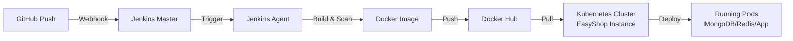

# 🛍️ EasyShop - Modern E-commerce Platform

[](LICENSE)

EasyShop is a modern, full-stack e-commerce platform built with Next.js 14, TypeScript, and MongoDB. It features a beautiful UI with Tailwind CSS, secure authentication, real-time cart updates, and a seamless shopping experience.

## 📚 About This Repository

This project is a **DevOps practice repository** based on the original [EasyShop project by Md. Afzal Hassan Ehsani](https://github.com/iemafzalhassan/easyshop). The original application showcases excellent e-commerce development practices, and I am using it as a foundation to practice and implement **DevOps, Infrastructure as Code, CI/CD pipelines, and DevSecOps principles**.

### What I'm Practicing:

- **Terraform**: Writing Infrastructure as Code (IaC) to provision and manage cloud resources
- **Docker & Kubernetes**: Containerizing applications and orchestrating deployments
- **CI/CD Pipelines**: Building automated pipelines using Jenkins for continuous integration and deployment
- **DevSecOps**: Implementing security best practices throughout the development and deployment lifecycle
- **Git-based Deployments**: Using ArgoCD for GitOps-based application deployments
- **Infrastructure Automation**: Scripting deployment and configuration automation
- **Monitoring & Observability**: Setting up monitoring and logging for deployed applications

## ✨ Features

- 🎨 Modern and responsive UI with dark mode support
- 🔐 Secure JWT-based authentication
- 🛒 Real-time cart management with Redux
- 📱 Mobile-first design approach
- 🔍 Advanced product search and filtering
- 💳 Secure checkout process
- 📦 Multiple product categories
- 👤 User profiles and order history
- 🌙 Dark/Light theme support

## 🏗️ Architecture

EasyShop follows a three-tier architecture pattern:

### 1. Presentation Tier (Frontend)
- Next.js React Components
- Redux for State Management
- Tailwind CSS for Styling
- Client-side Routing
- Responsive UI Components

### 2. Application Tier (Backend)
- Next.js API Routes
- Business Logic
- Authentication & Authorization
- Request Validation
- Error Handling
- Data Processing

### 3. Data Tier (Database)
- MongoDB Database
- Mongoose ODM
- Data Models
- CRUD Operations
- Data Validation


### Key Features of the Architecture
- **Separation of Concerns**: Each tier has its specific responsibilities
- **Scalability**: Independent scaling of each tier
- **Maintainability**: Modular code organization
- **Security**: API routes handle authentication and data validation
- **Performance**: Server-side rendering and static generation
- **Real-time Updates**: Redux for state management

### Data Flow
1. User interacts with React components
2. Actions are dispatched to Redux store
3. API clients make requests to Next.js API routes
4. API routes process requests through middleware
5. Business logic handles data operations
6. Mongoose ODM interacts with MongoDB
7. Response flows back through the tiers

## 🚀 Getting Started

### Docker Setup Guide

This guide will help you run EasyShop using Docker containers. No local Node.js or MongoDB installation required!

### Prerequisites

1. Install [Docker](https://docs.docker.com/get-docker/) on your machine
2. Basic understanding of terminal/command line

### Step 1: Environment Setup

1. Create a file named `.env.local` in the root directory with the following content:
```env
# Database Configuration
MONGODB_URI=mongodb://easyshop-mongodb:27017/easyshop

# NextAuth Configuration
NEXTAUTH_URL=http://localhost:3000  # Replace with your EC2 instance's public IP or put localhost:3000
NEXT_PUBLIC_API_URL=http://localhost:3000/api  # Replace with your EC2 instance's public IP or put localhost:3000/api
NEXTAUTH_SECRET=your-nextauth-secret-key  # Generate this using the command below

# JWT Configuration
JWT_SECRET=your-jwt-secret-key  # Generate this using the command below
```

> [!IMPORTANT]
> When deploying to EC2, make sure to replace `your-ec2-ip` with your actual EC2 instance's public IP address.

To generate secure secret keys, use these commands in your terminal:
```bash
# For NEXTAUTH_SECRET
openssl rand -base64 32

# For JWT_SECRET
openssl rand -hex 32
```

### Step 2: Running the Application

You have two options to run the application:

#### Option 1: Using Docker Compose (Recommended)

This is the easiest way to run the application. All services will be started in the correct order with proper dependencies.

```bash
# Start all services
docker compose up -d

# View logs
docker compose logs -f

# Stop all services
docker compose down
```

#### Option 2: Manual Docker Commands

If you prefer more control, you can run each service manually:

1. Create a Docker network:
```bash
docker network create easyshop-network
```

2. Start MongoDB:
```bash
docker run -d \
  --name easyshop-mongodb \
  --network easyshop-network \
  -p 27017:27017 \
  -v mongodb_data:/data/db \
  mongo:latest
```

3. Build the main application:
```bash
docker build -t easyshop .
```

4. Build and run data migration:
```bash
# Build migration image
docker build -t easyshop-migration -f scripts/Dockerfile.migration .

# Run migration
docker run --rm \
  --network easyshop-network \
  --env-file .env.local \
  easyshop-migration
```

5. Start the EasyShop application:
```bash
docker run -d \
  --name easyshop \
  --network easyshop-network \
  -p 3000:3000 \
  --env-file .env.local \
  easyshop:latest
```

### Accessing the Application

1. Open your web browser
2. Visit [http://localhost:3000](http://localhost:3000)
3. You should see the EasyShop homepage!

### Useful Docker Commands

```bash
# View running containers
docker ps

# View container logs
docker logs easyshop
docker logs easyshop-mongodb

# Stop containers
docker stop easyshop easyshop-mongodb

# Remove containers
docker rm easyshop easyshop-mongodb

# Remove network
docker network rm easyshop-network
```

### Troubleshooting

1. If you can't connect to MongoDB:
   - Make sure the MongoDB container is running: `docker ps`
   - Check MongoDB logs: `docker logs easyshop-mongodb`
   - Verify network connection: `docker network inspect easyshop-network`

2. If the application isn't accessible:
   - Check if the container is running: `docker ps`
   - View application logs: `docker logs easyshop`
   - Make sure port 3000 isn't being used by another application

3. If migration fails:
   - Check if MongoDB is running and accessible
   - View migration logs when running the migration command
   - Verify your .env.local file has the correct MongoDB URI

For any other issues, please create a GitHub issue with the error details.

## 🧪 Testing

> [!NOTE]
> Coming soon: Unit tests and E2E tests with Jest and Cypress

## 🔧 Troubleshooting

### Build Errors

1. **Dynamic Server Usage Warnings**
```bash
Error: Dynamic server usage: Page couldn't be rendered statically
```
**Solution**: This is expected behavior for dynamic routes and API endpoints. These warnings appear during build but won't affect the application's functionality.

2. **MongoDB Connection Issues**
```bash
Error: MongoDB connection failed
```
**Solution**: 
- Ensure MongoDB is running locally
- Check if your MongoDB connection string is correct in `.env.local`
- Try connecting to MongoDB using MongoDB Compass with the same connection string

### Development Tips
- Clear `.next` folder if you encounter strange build issues: `rm -rf .next`
- Run `npm install` after pulling new changes
- Make sure all environment variables are properly set
- Use Node.js version 18 or higher

## 📦 Project Structure

```
easyshop/
├── src/
│   ├── app/              # Next.js App Router pages
│   ├── components/       # Reusable React components
│   ├── lib/             # Utilities and configurations
│   │   ├── auth/        # Authentication logic
│   │   ├── db/          # Database configuration
│   │   └── features/    # Redux slices
│   ├── types/           # TypeScript type definitions
│   └── styles/          # Global styles and Tailwind config
├── public/              # Static assets
└── scripts/            # Database migration scripts
```

## 🤝 Contributing

We welcome contributions! Please follow these steps:

1. Fork the repository
2. Create a new branch: `git checkout -b feature/amazing-feature`
3. Make your changes
4. Run tests: `npm test` (coming soon)
5. Commit your changes: `git commit -m 'Add amazing feature'`
6. Push to the branch: `git push origin feature/amazing-feature`
7. Open a Pull Request

> [!TIP]
> Check our [Contributing Guidelines](CONTRIBUTING.md) for more details

## 📝 License

This project is licensed under the MIT License - see the [LICENSE](LICENSE) file for details.

## 🙏 Acknowledgments

- [Next.js](https://nextjs.org/)
- [Tailwind CSS](https://tailwindcss.com/)
- [MongoDB](https://www.mongodb.com/)
- [Redux Toolkit](https://redux-toolkit.js.org/)
- [Radix UI](https://www.radix-ui.com/)

## 📫 Contact

For questions or feedback, please open an issue or contact the maintainers:

- Maintainer - [@Md. Afzal hassan Ehsani](https://github.com/iemafzalhassan)
- Project Link: [https://github.com/iemafzalhassan/easyshop](https://github.com/iemafzalhassan/easyshop)

---

<div align="center">
  <p>
    Made with ❤️ by <a href="https://iemafzalhassan.tech" target="_blank"><b>Md. Afzal Hassan Ehsani</b></a>
  </p>
</div>


# 🚀 DevOps Deployment Guide

This section provides comprehensive instructions on deploying EasyShop using Infrastructure as Code (Terraform), Kubernetes (KIND), and CI/CD pipelines (Jenkins).

## Table of Contents
1. [Prerequisites](#prerequisites)
2. [Understanding the Infrastructure](#understanding-the-infrastructure)
3. [Terraform Setup & Deployment](#terraform-setup--deployment)
4. [Kubernetes Setup with KIND](#kubernetes-setup-with-kind)
5. [Jenkins CI/CD Pipeline](#jenkins-cicd-pipeline)
6. [GitHub Webhooks Configuration](#github-webhooks-configuration)

---

## Prerequisites

Before proceeding, ensure you have:

- An **AWS Account** with appropriate permissions to create EC2 instances, VPCs, and security groups
- **Terraform** installed (version 1.0+): [Download here](https://www.terraform.io/downloads.html)
- **Git** installed on your local machine
- **SSH Key Pair**: Generate using `ssh-keygen -t rsa -b 4096 -f easyshop-ssh-key`
- **AWS CLI** configured: `aws configure` with your access keys

---

## Understanding the Infrastructure

### 🏗️ Architecture Overview

Your infrastructure consists of **3 EC2 instances** orchestrated by Terraform:

| Instance | Name | Type | Size | Purpose | Installed Components |
|----------|------|------|------|---------|----------------------|
| **1** | easyshop | m7i-flex.large | 30GB | Kubernetes Master + Worker | Docker, KIND, kubectl, Java |
| **2** | jenkins-ec2 | t3.small | 10GB | Jenkins Server | Jenkins, Java, Git |
| **3** | jenkins-agent | m7i-flex.large | 20GB | Jenkins Build Agent | Docker, Java, Trivy |

### 📋 What Each Script Does

#### **`scripts/kind.sh`** (EasyShop Instance)
Runs on the `easyshop` EC2 instance:
- Updates system packages
- Installs Docker Engine with latest stable version
- Downloads and installs KIND (Kubernetes in Docker) v0.31.0
- Installs Java 21 JRE (for Jenkins agent capabilities)
- Creates a multi-node Kubernetes cluster (1 Control Plane + 3 Worker nodes)
- Prepares the environment to deploy containerized applications

#### **`scripts/install_jenkins.sh`** (Jenkins Server)
Runs on the `jenkins-ec2` instance:
- Updates system packages
- Installs Java 21 JRE (Jenkins requirement)
- Adds Jenkins official repository
- Installs Jenkins server with all dependencies
- Prepares Jenkins to manage CI/CD pipelines

#### **`scripts/install_docker_&_java.sh`** (Jenkins Agent)
Runs on the `jenkins-agent` instance:
- Installs Docker Engine for building container images
- Installs Java 21 JRE for Jenkins agent communication
- Installs **Trivy** (security scanner for container images)
- Configures Docker user permissions
- Enables the instance to act as a Jenkins build agent

---

## Terraform Setup & Deployment

### Step 1: Initialize AWS Credentials

```bash
# Configure AWS CLI with your credentials
aws configure

# You'll be prompted for:
# AWS Access Key ID: [your-access-key]
# AWS Secret Access Key: [your-secret-key]
# Default region name: eu-west-1
# Default output format: json
```

### Step 2: Prepare SSH Keys

```bash
# Generate SSH key pair if you don't have one
ssh-keygen -t rsa -b 4096 -f easyshop-ssh-key

# This creates:
# - easyshop-ssh-key (private key - keep safe)
# - easyshop-ssh-key.pub (public key - used by Terraform)

# The public key is already referenced in terraform/variables.tf
```

### Step 3: Update Terraform Variables (Optional)

Edit `terraform/variables.tf` if you want to change:

```terraform
variable "aws_region" {
  default = "eu-west-1"  # Change AWS region if needed
}

variable "ami_id" {
  default = "ami-03446a3af42c5e74e"  # Ubuntu 22.04 LTS for eu-west-1
  # For other regions, get AMI ID from: https://cloud-images.ubuntu.com/locator/
}

variable "instance" {
  # Modify instance types or volume sizes as needed
  # Example: Change "m7i-flex.large" to "t3.large" for cost optimization
}
```

### Step 4: Deploy Infrastructure with Terraform

```bash
# Navigate to terraform directory
cd terraform

# Initialize Terraform (downloads required providers)
terraform init

# Preview what will be created (always do this before apply!)
terraform plan -out=tfplan

# Apply the configuration to create AWS resources
terraform apply tfplan

# Terraform will output the public IPs of your instances
# Save these IPs for later steps
```

### Step 5: Terraform Outputs

After successful deployment, Terraform outputs:

```
Outputs:

easyshop_public_ip = "xx.xx.xx.xx"
jenkins_server_public_ip = "yy.yy.yy.yy"
jenkins_agent_public_ip = "zz.zz.zz.zz"
```

> [!IMPORTANT]
> Save these IP addresses. You'll need them to:
> - Access Jenkins: `http://jenkins_server_public_ip:8080`
> - SSH into instances: `ssh -i easyshop-ssh-key ubuntu@instance-ip`
> - Configure webhooks

### Step 6: Verify Instance Initialization

Wait 2-3 minutes for instances to complete user data scripts:

```bash
# SSH into each instance to verify setup
ssh -i easyshop-ssh-key ubuntu@<easyshop-ip>
  # Check: docker --version, kind --version, java -version
  
ssh -i easyshop-ssh-key ubuntu@<jenkins-ip>
  # Check: java -version, systemctl status jenkins

ssh -i easyshop-ssh-key ubuntu@<jenkins-agent-ip>
  # Check: docker --version, trivy --version
```

### Step 7: (Optional) Destroy Infrastructure

```bash
cd terraform

# Remove all AWS resources
terraform destroy

# Confirm by typing 'yes' when prompted
```

---

## Kubernetes Setup with KIND

### Overview

The `easyshop` instance automatically sets up a KIND cluster. Here's what happens:

### Cluster Configuration

The KIND cluster created has:
- **1 Control Plane Node**: Manages the cluster
- **3 Worker Nodes**: Run your application containers
- **Volume Mounts**: Local storage for databases (MongoDB, Redis)
- **Port Mapping**: Exposes ports 80, 443, 3000 to the host

### Accessing the Kubernetes Cluster

```bash
# SSH into the easyshop instance
ssh -i easyshop-ssh-key ubuntu@<easyshop-public-ip>

# List all KIND clusters
kind get clusters

# Get cluster information
kubectl cluster-info

# View all nodes
kubectl get nodes

# View all namespaces
kubectl get namespaces
```

### Deploying Applications to Kubernetes

The `kubernetes/esayshop-k8s/` directory contains deployment manifests:

```bash
# SSH into easyshop instance (if not already)
ssh -i easyshop-ssh-key ubuntu@<easyshop-public-ip>

# Create namespace (if not exists)
kubectl create namespace easyshop
kubectl label namespace easyshop name=easyshop

# Deploy MongoDB, Redis, and the EasyShop app
kubectl apply -f kubernetes/esayshop-k8s/namespace.yml
kubectl apply -f kubernetes/esayshop-k8s/mongoPv.yml
kubectl apply -f kubernetes/esayshop-k8s/mongoPvc.yml
kubectl apply -f kubernetes/esayshop-k8s/mongoDeployment.yml
kubectl apply -f kubernetes/esayshop-k8s/mongoService.yml

kubectl apply -f kubernetes/esayshop-k8s/redisPv.yml
kubectl apply -f kubernetes/esayshop-k8s/redisPvc.yml
kubectl apply -f kubernetes/esayshop-k8s/redisDeployment.yml
kubectl apply -f kubernetes/esayshop-k8s/redisService.yml

kubectl apply -f kubernetes/esayshop-k8s/easyshopDeployment.yml
kubectl apply -f kubernetes/esayshop-k8s/easyshopService.yml
kubectl apply -f kubernetes/esayshop-k8s/migration-job.yml

# Verify deployments
kubectl get deployments -n easyshop
kubectl get pods -n easyshop
kubectl get services -n easyshop
```

### Useful Kubernetes Commands

```bash
# View pod logs
kubectl logs <pod-name> -n easyshop

# Execute command inside a pod
kubectl exec -it <pod-name> -n easyshop -- /bin/bash

# Port forward to access service locally
kubectl port-forward svc/easyshop 3000:3000 -n easyshop

# Delete all resources in namespace
kubectl delete all --all -n easyshop

# Watch pod status in real-time
kubectl get pods -n easyshop -w
```

---

## Jenkins CI/CD Pipeline

### Step 1: Access Jenkins

1. Wait 3-5 minutes after instance creation for Jenkins to fully start
2. Open browser and navigate to: `http://<jenkins-public-ip>:8080`
3. Follow initial setup wizard

### Step 2: Unlock Jenkins

```bash
# SSH into Jenkins instance
ssh -i easyshop-ssh-key ubuntu@<jenkins-public-ip>

# Get the initial admin password
sudo cat /var/lib/jenkins/secrets/initialAdminPassword

# Copy the password and paste it in Jenkins UI
```

### Step 3: Install Required Plugins

1. In Jenkins UI → **Manage Jenkins** → **Manage Plugins**
2. Search and install:
   - `Pipeline`
   - `GitHub Integration`
   - `Docker`
   - `Email Extension`
   - `Credentials`

### Step 4: Add Jenkins Agent

**On Jenkins Master:**
1. **Manage Jenkins** → **Manage Nodes and Clouds** → **New Node**
2. **Node name**: `dev`
3. **Type**: Permanent Agent
4. **Remote root directory**: `/home/ubuntu/jenkins`
5. **Labels**: `dev`
6. **Launch method**: Launch agents via SSH
7. **Host**: `<jenkins-agent-public-ip>`
8. **SSH key**: Add your `easyshop-ssh-key` private key
9. Click **Test Connection** then **Save**

### Step 5: Create a New Pipeline Job

1. **New Item** → Enter name → Select **Pipeline** → **OK**
2. Under **Pipeline** section:
   - **Definition**: `Pipeline script from SCM`
   - **SCM**: `Git`
   - **Repository URL**: `https://github.com/ayushsoni155/EasyShop-k8s`
   - **Branch**: `*/k8s-test`
   - **Script Path**: `Jenkinsfile`

### Step 6: Configure Credentials

Store sensitive data in Jenkins:

1. **Manage Jenkins** → **Manage Credentials** → **System** → **Global credentials**
2. **Add Credentials** → **Username with password**
3. Create credentials for:
   - `DOCKERHUB_CRED`: Docker Hub username & password
   - `GITHUB_TOKEN`: GitHub personal access token

### Step 7: Understand the Jenkinsfile

Your `Jenkinsfile` does:

```groovy
pipeline {
    agent { label 'dev' }  # Runs on jenkins-agent (labeled 'dev')
    
    stages {
        // Stage 1: Checkout code from GitHub
        stage('Checkout') {
            steps {
                git branch: 'k8s-test', url: 'https://github.com/ayushsoni155/EasyShop-k8s'
            }
        }
        
        // Stage 2: Build Docker image
        stage('Build') {
            steps {
                sh "docker build -t ayushsoni155/easyshop-app:${BUILD_TAG} ."
            }
        }
        
        // Stage 3: Security scanning with Trivy
        stage('Security Scan (Trivy)') {
            steps {
                sh "trivy image --severity HIGH,CRITICAL ayushsoni155/easyshop-app:${BUILD_TAG}"
            }
        }
        
        // Stage 4: Push to Docker Hub & Deploy
        stage('Push & Deploy') {
            steps {
                // Login to Docker Hub with credentials
                withCredentials([usernamePassword(credentialsId: "DOCKERHUB_CRED", ...)]) {
                    sh "docker login -u ${DOCKERHUB_USER} -p ${DOCKERHUB_PASS}"
                    sh "docker push ayushsoni155/easyshop-app:${BUILD_TAG}"
                }
            }
        }
    }
    
    // Send email notifications on success/failure
    post {
        success {
            emailext subject: "Build Successful", to: 'your-email@example.com'
        }
        failure {
            emailext subject: "Build Failed", to: 'your-email@example.com'
        }
    }
}
```

### Step 8: Run Your First Pipeline

1. **Build Now** to trigger the pipeline manually
2. Monitor build progress in **Build Console**
3. Fix any issues and commit to your `k8s-test` branch
4. Pipeline will automatically rebuild on push (if webhook is configured)

---

## GitHub Webhooks Configuration

### Why Use Webhooks?

Webhooks automatically trigger Jenkins builds when you push code to GitHub, enabling **true CI/CD**.

### Step 1: Generate GitHub Personal Access Token

1. Go to **GitHub Settings** → **Developer settings** → **Personal access tokens** → **Tokens (classic)**
2. Click **Generate new token (classic)**
3. **Token name**: `Jenkins-EasyShop`
4. **Scopes**: Select `repo` and `admin:repo_hook`
5. Click **Generate token** and copy it (save it securely)

### Step 2: Add GitHub Credentials to Jenkins

1. **Manage Jenkins** → **Manage Credentials** → **System** → **Global credentials**
2. **Add Credentials** → **Username with password**
3. **Username**: Your GitHub username
4. **Password**: The token you just created
5. **ID**: `GITHUB_TOKEN`
6. Click **Create**

### Step 3: Configure Webhook in GitHub Repository

1. Go to your repository: `https://github.com/ayushsoni155/EasyShop-k8s`
2. **Settings** → **Webhooks** → **Add webhook**
3. Fill in:
   - **Payload URL**: `http://<jenkins-public-ip>:8080/github-webhook/`
   - **Content type**: `application/json`
   - **Which events would you like to trigger this webhook?**: Select **Push events** (and **Pull requests** if desired)
   - **Active**: ✓ Checked
4. Click **Add webhook**

### Step 4: Test the Webhook

```bash
# Make a test commit and push to the k8s-test branch
git add .
git commit -m "Test webhook"
git push origin k8s-test

# Jenkins should automatically trigger the pipeline
# Check Jenkins UI or GitHub webhook delivery logs
```

### Step 5: Verify Webhook Delivery (GitHub Side)

1. Go to repository **Settings** → **Webhooks**
2. Click on your webhook
3. Check the **Recent Deliveries** tab
4. Click on a delivery to see request/response details

### Step 6: Verify Pipeline Triggered (Jenkins Side)

1. In Jenkins, your pipeline job should show a new build
2. Check **Build History** for recent builds
3. Click on build number to view console output

---

## Troubleshooting

### Terraform Issues

```bash
# Validate Terraform configuration
terraform validate

# Check formatting
terraform fmt

# Check state
terraform state list
terraform state show aws_instance.easyshop_instance['easyshop']
```

### Kubernetes Issues

```bash
# Check node status
kubectl get nodes

# Describe pod for error details
kubectl describe pod <pod-name> -n easyshop

# Check pod events
kubectl get events -n easyshop --sort-by='.lastTimestamp'

# View logs
kubectl logs <pod-name> -n easyshop --previous
```

### Jenkins Issues

```bash
# Check Jenkins service status
sudo systemctl status jenkins
sudo systemctl restart jenkins

# View Jenkins logs
sudo tail -f /var/log/jenkins/jenkins.log

# Check agent connection
sudo tail -f /var/lib/jenkins/logs/agents/dev/agent.log
```

---

## Next Steps

- [ ] Deploy monitoring stack (Prometheus + Grafana)
- [ ] Configure ArgoCD for GitOps deployments
- [ ] Set up security policies with OPA/Gatekeeper
- [ ] Implement backup strategies for persistent volumes
- [ ] Set up log aggregation (ELK Stack or Loki)

---

## Summary



This DevOps setup provides:
- ✅ Infrastructure as Code (Terraform)
- ✅ Container Orchestration (Kubernetes/KIND)
- ✅ Automated CI/CD (Jenkins)
- ✅ Security Scanning (Trivy)
- ✅ Git-based Automation (GitHub Webhooks)
